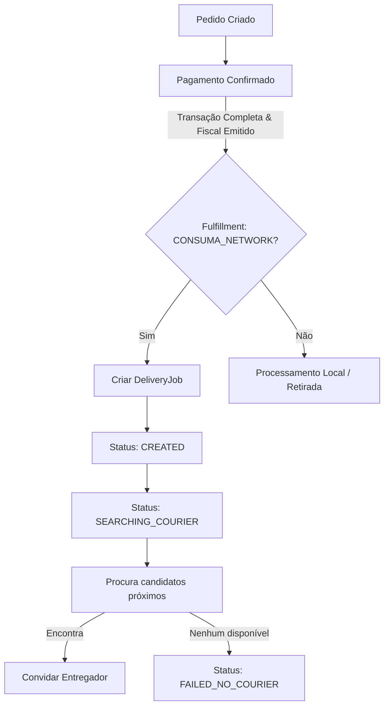
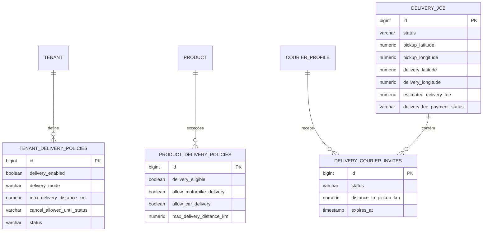

# CONSUMA Delivery Readiness Core & Independent Courier Network

Este documento detalha a arquitetura técnica, fluxo operacional e especificações da camada de logística urbana e fulfillment logístico da plataforma multi-tenant **CONSUMA**.

---

## 1. Arquitetura Operativa & Princípios

A camada de entrega e fulfillment da CONSUMA é projetada seguindo o princípio da **desacoplamento logístico puro**. A inicialização de um job de entrega ocorre estritamente após a confirmação financeira (pagamento do pedido) e qualquer falha na alocação de entregadores ou na execução da entrega **nunca** reverte a transação de faturamento nem afeta os saldos fiscais emitidos.

---

## 2. Modelagem do Banco de Dados

Toda a persistência está mapeada com base na migração Flyway `V61__delivery_core.sql`, estruturada da seguinte forma:

---

## 3. Máquina de Estados do DeliveryJob

A entrega evolui através de um ciclo de vida rigoroso, garantindo idempotência técnica e controle de auditoria operacional a cada alteração de estado:

| Estado Origem | Transição (Ação) | Estado Destino | Responsável | Audit Log Event |
| :--- | :--- | :--- | :--- | :--- |
| - | Criação Automática | `CREATED` | System (Listener) | `DELIVERY_JOB_CREATED` |
| `CREATED` | Iniciar busca | `SEARCHING_COURIER` | System (Matching) | `DELIVERY_COURIER_SEARCH_STARTED` |
| `SEARCHING_COURIER` | Entregador compatível localizado | `COURIER_INVITED` | System (Matching) | `DELIVERY_COURIER_INVITED` |
| `COURIER_INVITED` | Aceitar convite | `COURIER_ACCEPTED` | Entregador | `DELIVERY_COURIER_INVITE_ACCEPTED` |
| `COURIER_ACCEPTED` | Confirmar atribuição | `ASSIGNED` | System | `DELIVERY_JOB_ASSIGNED` |
| `COURIER_INVITED` | Rejeitar convite | `COURIER_REJECTED` | Entregador | `DELIVERY_COURIER_INVITE_REJECTED` |
| `COURIER_REJECTED` | Reiniciar busca | `SEARCHING_COURIER` | System | `DELIVERY_COURIER_SEARCH_STARTED` |
| `SEARCHING_COURIER` | Nenhum entregador encontrado | `FAILED_NO_COURIER` | System | `DELIVERY_FAILED_NO_COURIER` |
| `ANY` (Até Pickup) | Cancelar pedido | `CANCELLED_BY_CUSTOMER` / `CANCELLED_BY_TENANT` | Cliente / Tenant | `DELIVERY_CANCELLED_BY_CUSTOMER` |
| `ASSIGNED` | Pronto para retirada | `PICKUP_READY` | Estabelecimento | `DELIVERY_PICKUP_READY` |
| `PICKUP_READY` | Coletado | `PICKED_UP` | Entregador | `DELIVERY_PICKED_UP` |
| `PICKED_UP` | Iniciar transporte | `IN_TRANSIT` | Entregador | `DELIVERY_IN_TRANSIT` |
| `IN_TRANSIT` | Entregar ao destino | `DELIVERED` | Entregador | `DELIVERY_DELIVERED` |
| `IN_TRANSIT` | Reportar quebra/incidente | `FAILED_DELIVERY_PROBLEM` | Entregador | `DELIVERY_ISSUE_REPORTED` |

---

## 4. Algoritmo de Proximidade e Filtros de Elegibilidade

O matching de entregadores no `DeliveryCourierMatchingService` funciona através de múltiplos filtros e etapas sucessivas em tempo de execução:

1. **Localização Ativa**: Apenas entregadores com atualização de coordenadas GPS nas últimas 12 horas.
2. **Disponibilidade**: Filtro por status do courier ativo (`ACTIVE`), verificado (`VERIFIED`) e disponibilidade online imediata (`ONLINE_AVAILABLE`).
3. **Sem Atribuições Ativas**: Não possuir nenhum `activeDeliveryJobId` pendente (garante uma entrega por vez por courier).
4. **Restrições de Produto**: Avaliação do carrinho. Se qualquer produto no pedido possuir política de entrega personalizada desabilitando motos (`allowMotorbikeDelivery = false`), entregadores com motos são ignorados.
5. **Cálculo da Distância (Haversine)**:
   $$\text{Distância} = 2 \cdot r \cdot \arcsin\left(\sqrt{\sin^2\left(\frac{\Delta \text{lat}}{2}\right) + \cos(\text{lat}_1) \cdot \cos(\text{lat}_2) \cdot \sin^2\left(\frac{\Delta \text{lon}}{2}\right)}\right)$$
   Onde $r = 6371.0\text{ km}$ (raio médio da Terra).
6. **Limiar da Política**: Distância total menor que o menor valor entre `TenantDeliveryPolicy.maxDeliveryDistanceKm` e a distância limite do produto mais sensível.
7. **Ordenação**: Classificação dos candidatos por menor distância (mais próximo primeiro).

---

## 5. Ledger & Evidência de Entrega (Evidence Bundle)

Cada transição de estado da entrega dispara eventos operacionais registrados no livro-razão central de auditoria (`OperationalEventLog`):
- A mudança para `DELIVERED` consolida o carimbo de data/hora, coordenadas do entregador, placa do veículo mascarada e nome do entregador.
- Essa assinatura auditável é encapsulada na seção de `deliveryEvidence` no Evidence Bundle de finalização da sessão de consumo, garantindo compliance fiscal e de prestação de contas operacionais.

---

## 6. APIs REST Expostas

### 6.1. Endpoints do Tenant / Admin (`/tenant/delivery`)
- `GET /tenant/delivery/policy` - Recupera as configurações de entrega do estabelecimento.
- `PUT /tenant/delivery/policy` - Atualiza regras de entrega, distância e janelas de cancelamento.
- `GET /tenant/delivery/product-policies` - Lista exceções para produtos individuais.
- `PUT /tenant/delivery/product-policies/{productId}` - Altera elegibilidade ou veículos permitidos para um produto específico.
- `GET /tenant/delivery/fulfillments` - Lista as solicitações de entrega em andamento.
- `POST /tenant/delivery/fulfillments/{fulfillmentId}/mark-ready-for-pickup` - Marca o pacote como pronto para retirada do entregador.
- `GET /tenant/delivery/jobs` - Lista todos os jobs de entregadores independentes criados.

### 6.2. Endpoints do Cliente Público (`/public`)
- `GET /public/tenants/{tenantCode}/delivery/options` - Retorna as opções de entrega e taxas aplicáveis na simulação de checkout.
- `POST /public/orders/{pedidoId}/fulfillment` - Registra ou altera o tipo de fulfillment e as coordenadas geográficas do endereço de entrega.
- `POST /public/delivery/jobs/{jobId}/cancel-by-customer` - Cancela o job de entrega de forma autônoma se estiver dentro das regras permitidas pela política do tenant.

### 6.3. Endpoints do Entregador Parceiro (`/courier`)
- `POST /courier/register` - Registro público (sem autenticação) de um novo entregador na rede consuma.
- `GET /courier/profile` - Consulta os dados do perfil do entregador logado.
- `POST /courier/availability/online` - Altera a disponibilidade operativa para receber chamadas (`ONLINE_AVAILABLE`).
- `POST /courier/availability/offline` - Altera o status para inativo (`OFFLINE`).
- `POST /courier/location` - Reporta coordenadas em tempo real (telemetria GPS).
- `GET /courier/delivery/invites` - Lista convites de entrega pendentes na região.
- `POST /courier/delivery/invites/{inviteId}/accept` - Aceita o convite e assume a entrega de forma exclusiva.
- `POST /courier/delivery/invites/{inviteId}/reject` - Recusa o convite (o sistema reiniciará a fila de matching).
- `POST /courier/delivery/jobs/{jobId}/picked-up` - Marca a retirada do pacote no estabelecimento.
- `POST /courier/delivery/jobs/{jobId}/in-transit` - Sinaliza o início do trajeto de entrega ao cliente final.
- `POST /courier/delivery/jobs/{jobId}/delivered` - Confirma a entrega bem-sucedida e liquida as taxas operacionais.

---

## 7. Estrutura de Tratamento de Erros e Negócio

Para garantir que os fluxos de integração funcionem sem falhas ambíguas, as seguintes exceções do domínio de negócios são lançadas e manipuladas centralmente:

* **`DELIVERY_POLICY_DISABLED`**: Tentativa de solicitar entrega em um estabelecimento com políticas de entrega inativas.
* **`DELIVERY_JOB_INVALID_STATE`**: Transição de estado inválida na máquina de estados (ex: marcar um pedido entregue diretamente da criação).
* **`DELIVERY_COURIER_ALREADY_BUSY`**: O entregador tentou aceitar um convite enquanto seu perfil já possuía uma entrega ativa vinculada.
* **`DELIVERY_INVITE_EXPIRED`**: Aceitação fora da janela temporal de validade do convite de matching.
* **`DELIVERY_CANCEL_NOT_ALLOWED`**: O cliente tentou cancelar a entrega após a alocação do entregador ou após a coleta do produto, violando a política do tenant.
